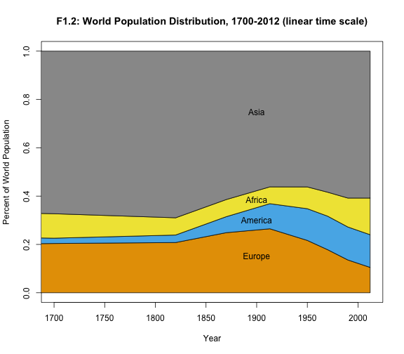
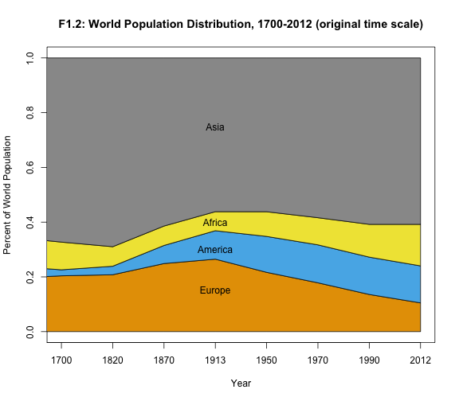
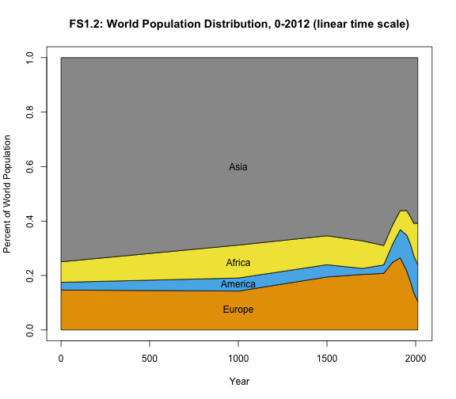
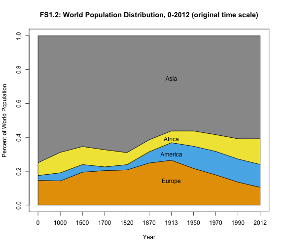

Capital in the 21st Century: Chapter 1
========================================================

### Data provenance

The data were downloaded as Excel files from: http://piketty.pse.ens.fr/en/capital21c2. 

### Loading libraries and data for Figures F1.1 and FS1.1

This document depends on the [xlsx](http://cran.r-project.org/web/packages/xlsx/index.html) package.


```r
library(xlsx)

fig1s1_dat = read.xlsx(
    "../Piketty2014FiguresTables/Chapter1TablesFigures.xlsx", 
    sheetName="TS1.1a", rowIndex=7:18, colIndex=c(1,3:6), header=TRUE)
names(fig1s1_dat)[1] = "Year" 
fig1s1_dat$EAm = fig1s1_dat$Europe+fig1s1_dat$America
fig1s1_dat$EAmAf = fig1s1_dat$EAm+fig1s1_dat$Africa
```


## Figure F1.1

This code remakes Figure F1.1, scaling time on the x-axis linearly:


```r
plotdat = subset(fig1s1_dat, Year>=1700) #take out years before 1700
cbPalette <- c("#999999", "#E69F00", "#56B4E9", "#009E73", "#F0E442", 
    "#0072B2", "#D55E00", "#CC79A7") #ggplot2 recommended colorblind palette
plot(plotdat$Year, rep(0, nrow(plotdat)), 
    type='n', ylim=c(0,1), xlab="Year", ylab='World Output')
yearRevYear = c(plotdat$Year, rev(plotdat$Year))
polygon(x=yearRevYear, y=c(rep(0, nrow(plotdat)), rev(plotdat$Europe)), col=cbPalette[2])
polygon(x=yearRevYear, y=c(plotdat$Europe, rev(plotdat$EAm)), col=cbPalette[3])
polygon(x=yearRevYear, y=c(plotdat$EAm, rev(plotdat$EAmAf)), col=cbPalette[5])
polygon(x=yearRevYear, y=c(plotdat$EAmAf, rep(1, nrow(plotdat))), col=cbPalette[1])
text(1950, 0.9, 'Asia')
text(1950, 0.764, 'Africa')
text(1950, 0.55, 'America')
text(1950, 0.2, 'Europe')
title("F1.1: World Output, 1700-2012 (linear time scale)")
```

 

This code remakes Figure F1.1 as it appears in the original analysis: data points on the x-axis are equally spaced, no matter how far apart in time they are:


```r
plot(1:8, rep(0,8), type='n', xaxt='n', ylim=c(0,1), xlab="Year", 
    ylab='World Output')
axis(side=1, at=1:8, labels=plotdat$Year)
xcoords = c(1:8, 8:1)
polygon(x=xcoords, y=c(rep(0,8), rev(plotdat$Europe)), col=cbPalette[2])
polygon(x=xcoords, y=c(plotdat$Europe, rev(plotdat$EAm)), col=cbPalette[3])
polygon(x=xcoords, y=c(plotdat$EAm, rev(plotdat$EAmAf)), col=cbPalette[5])
polygon(x=xcoords, y=c(plotdat$EAmAf, rep(1,8)), col=cbPalette[1])
text(5, 0.9, 'Asia')
text(5, 0.764, 'Africa')
text(5, 0.55, 'America')
text(5, 0.2, 'Europe')
title("F1.1: World Output, 1700-2012 (original x-axis)")
```

 

## Figure FS1.1

This code remakes Figure FS1.1, scaling time on the x-axis linearly:


```r
cbPalette <- c("#999999", "#E69F00", "#56B4E9", "#009E73", "#F0E442", "#0072B2", "#D55E00", "#CC79A7")
plot(fig1s1_dat$Year, rep(0,nrow(fig1s1_dat)), 
    type='n', ylim=c(0,1), xlab="Year", ylab='World Output')
yearRevYear = c(fig1s1_dat$Year, rev(fig1s1_dat$Year))
polygon(x=yearRevYear, y=c(rep(0,nrow(fig1s1_dat)), rev(fig1s1_dat$Europe)), col=cbPalette[2])
polygon(x=yearRevYear, y=c(fig1s1_dat$Europe, rev(fig1s1_dat$EAm)), col=cbPalette[3])
polygon(x=yearRevYear, y=c(fig1s1_dat$EAm, rev(fig1s1_dat$EAmAf)), col=cbPalette[5])
polygon(x=yearRevYear, y=c(fig1s1_dat$EAmAf, rep(1, nrow(fig1s1_dat))), col=cbPalette[1])
text(1950, 0.9, 'Asia')
text(1950, 0.764, 'Africa')
text(1950, 0.55, 'America')
text(1950, 0.2, 'Europe')
title("FS1.1: Distribution of World Output, 0-2012 (linear time scale)")
```

 

And this code remakes Figure FS1.1, scaling time as it was scaled in the original figure:


```r
plot(1:11, rep(0,11), type='n', xaxt='n', ylim=c(0,1), xlab="Year", 
    ylab='World Output')
axis(side=1, at=1:11, labels=fig1s1_dat$Year)
xcoords = c(1:11, 11:1)
polygon(x=xcoords, y=c(rep(0,11), rev(fig1s1_dat$Europe)), col=cbPalette[2])
polygon(x=xcoords, y=c(fig1s1_dat$Europe, rev(fig1s1_dat$EAm)), col=cbPalette[3])
polygon(x=xcoords, y=c(fig1s1_dat$EAm, rev(fig1s1_dat$EAmAf)), col=cbPalette[5])
polygon(x=xcoords, y=c(fig1s1_dat$EAmAf, rep(1,11)), col=cbPalette[1])
text(8, 0.9, 'Asia')
text(8, 0.764, 'Africa')
text(8, 0.55, 'America')
text(8, 0.2, 'Europe')
title("FS1.1: Distribution of World Output, 0-2012 (original x-axis)")
```

 

### Loading data for figures F1.2 and SF1.2


```r
fig2s2_dat = read.xlsx(
    "../Piketty2014FiguresTables/Chapter1TablesFigures.xlsx", 
    sheetName="TS1.2", rowIndex=7:18, colIndex=c(1,3:6), header=TRUE)
names(fig2s2_dat)[1] = "Year" 
fig2s2_dat$EAm = fig2s2_dat$Europe+fig2s2_dat$America
fig2s2_dat$EAmAf = fig2s2_dat$EAm+fig2s2_dat$Africa

# colors:
cbPalette = c("#999999", "#E69F00", "#56B4E9", "#009E73", "#F0E442", 
    "#0072B2", "#D55E00", "#CC79A7") #ggplot2 recommended colorblind 

# a plotting function, since I find myself repeating my code a lot:
myRibbonPlot = function(dat, xlim=NULL, even_axis=FALSE, xlab='Year', ylab){
    stopifnot(all(c("Year", "Europe", "EAm", "EAmAf") %in% names(dat))) # this is a very specific function :) 
    if(even_axis){
        xcoords = c(1:nrow(dat), nrow(dat):1)
        xaxtype = 'n'
        if(!is.null(xlim)){
            xlim = match(xlim, dat$Year)
        }
    }else{
        xcoords = c(dat$Year, rev(dat$Year))
        xaxtype = NULL
    }
    plot(xcoords[1:(length(xcoords)/2)], rep(0, nrow(dat)), 
        type='n', ylim=c(0,1), xlab=xlab, ylab=ylab, xaxt=xaxtype, 
        xlim=xlim)
    polygon(x=xcoords, y=c(rep(0, nrow(dat)), rev(dat$Europe)), col=cbPalette[2])
    polygon(x=xcoords, y=c(dat$Europe, rev(dat$EAm)), col=cbPalette[3])
    polygon(x=xcoords, y=c(dat$EAm, rev(dat$EAmAf)), col=cbPalette[5])
    polygon(x=xcoords, y=c(dat$EAmAf, rep(1, nrow(dat))), col=cbPalette[1])
    if(even_axis){
        axis(side=1, at=xcoords[1:(length(xcoords)/2)], labels=dat$Year)
    }
}
```

## Figure F1.2

Here is code to re-make Figure F1.2, with time scaled linearly on the x-axis:


```r
myRibbonPlot(dat=fig2s2_dat, ylab="Percent of World Population", xlim=c(1700, 2012))
text(1900, 0.75, 'Asia')
text(1900, 0.385, 'Africa')
text(1900, 0.3, 'America')
text(1900, 0.15, 'Europe')
title("F1.2: World Population Distribution, 1700-2012 (linear time scale)")
```

 

And here is code to re-make Figure F1.2 with the x-axis scaled as it was in the original analysis (equal spacing between each year with data):


```r
myRibbonPlot(dat=fig2s2_dat, even_axis=TRUE, ylab='Percent of World Population', xlim=c(1700, 2012))
text(7, 0.75, 'Asia')
text(7, 0.4, 'Africa')
text(7, 0.3, 'America')
text(7, 0.15, 'Europe')
title("F1.2: World Population Distribution, 1700-2012 (original time scale)")
```

 

## Figure FS1.2

This code recreates figure FS1.2, scaling time linearly on the x-axis:


```r
myRibbonPlot(dat=fig2s2_dat, ylab="Percent of World Population")
text(1000, 0.6, 'Asia')
text(1000, 0.25, 'Africa')
text(1000, 0.17, 'America')
text(1000, 0.075, 'Europe')
title("FS1.2: World Population Distribution, 0-2012 (linear time scale)")
```

 

And this code recreates figure FS1.2, with the x-axis scaled as it was in the original analysis:


```r
myRibbonPlot(dat=fig2s2_dat, ylab="Percent of World Population", even_axis=TRUE)
text(7, 0.75, 'Asia')
text(7, 0.39, 'Africa')
text(7, 0.3, 'America')
text(7, 0.14, 'Europe')
title("FS1.2: World Population Distribution, 0-2012 (original time scale)")
```

 


### Loading data for Figures F1.3 and FS1.3


```r
fig3s3_dat = read.xlsx(
    "../Piketty2014FiguresTables/Chapter1TablesFigures.xlsx", 
    sheetName="TS1.3", rowIndex=7:18, colIndex=c(1:8), header=TRUE)
names(fig3s3_dat)[c(1,2,4,7,8)] = c("Year", "World", "America", "EuropeAmerica", "AsiaAfrica")
fig3s3_dat[2:8] = 100*fig3s3_dat[2:8]
```

### Figure F1.3

This code reproduces Figure F1.3, scaling the x-axis linearly with time:


```r
xcoords = fig3s3_dat$Year[4:11]
plot(xcoords, fig3s3_dat$World[4:11], ylim=c(0,250), xlim=c(1700,2012), xlab="Year", ylab="Per capita GDP as % of world average",col=cbPalette[3], pch=19)
grid()
lines(xcoords, fig3s3_dat$World[4:11], col=cbPalette[3], lwd=2)
points(xcoords, fig3s3_dat$EuropeAmerica[4:11], col=cbPalette[4], pch=19)
lines(xcoords, fig3s3_dat$EuropeAmerica[4:11], col=cbPalette[4], lwd=2)
points(xcoords, fig3s3_dat$AsiaAfrica[4:11], col=cbPalette[7], pch=19)
lines(xcoords, fig3s3_dat$AsiaAfrica[4:11], col=cbPalette[7], lwd=2)
title("F1.3: Global inequality, 1700-2012 (linear time scale)")
```

 

And here is the code for Figure F1.3 with an x-axis scaled as it is in the original analysis (equally spaced between years with data):


```r
xcoords = 1:8
plot(xcoords, fig3s3_dat$World[4:11], ylim=c(0,250), xlab="Year", ylab="Per capita GDP as % of world average",col=cbPalette[3], pch=19, xaxt='n')
grid()
axis(side=1, at=1:8, labels=fig3s3_dat$Year[4:11])
lines(xcoords, fig3s3_dat$World[4:11], col=cbPalette[3], lwd=2)
points(xcoords, fig3s3_dat$EuropeAmerica[4:11], col=cbPalette[4], pch=19)
lines(xcoords, fig3s3_dat$EuropeAmerica[4:11], col=cbPalette[4], lwd=2)
points(xcoords, fig3s3_dat$AsiaAfrica[4:11], col=cbPalette[7], pch=19)
lines(xcoords, fig3s3_dat$AsiaAfrica[4:11], col=cbPalette[7], lwd=2)
title("F1.3: Global inequality, 1700-2012 (original time scale)")
```

 

### Figure FS1.3

This code reproduces Figure SF1.3, with time scaled linearly on the x-axis:


```r
xcoords = fig3s3_dat$Year
plot(xcoords, fig3s3_dat$World, ylim=c(0,250), xlab="Year", ylab="Per capita GDP as % of world average",col=cbPalette[3], pch=19)
grid()
lines(xcoords, fig3s3_dat$World, col=cbPalette[3], lwd=2)
points(xcoords, fig3s3_dat$EuropeAmerica, col=cbPalette[4], pch=19)
lines(xcoords, fig3s3_dat$EuropeAmerica, col=cbPalette[4], lwd=2)
points(xcoords, fig3s3_dat$AsiaAfrica, col=cbPalette[7], pch=19)
lines(xcoords, fig3s3_dat$AsiaAfrica, col=cbPalette[7], lwd=2)
title("FS1.3: Global inequality, 0-2012 (linear time scale)")
```

 

And this code reproduces Figure SF1.3 with the time points evenly spaced on the x-axis, as they are in the original analysis:


```r
xcoords = 1:11
plot(xcoords, fig3s3_dat$World, ylim=c(0,250), xlab="Year", ylab="Per capita GDP as % of world average",col=cbPalette[3], pch=19, xaxt='n')
grid()
axis(side=1, at=1:11, labels=fig3s3_dat$Year)
lines(xcoords, fig3s3_dat$World, col=cbPalette[3], lwd=2)
points(xcoords, fig3s3_dat$EuropeAmerica, col=cbPalette[4], pch=19)
lines(xcoords, fig3s3_dat$EuropeAmerica, col=cbPalette[4], lwd=2)
points(xcoords, fig3s3_dat$AsiaAfrica, col=cbPalette[7], pch=19)
lines(xcoords, fig3s3_dat$AsiaAfrica, col=cbPalette[7], lwd=2)
title("SF1.3: Global inequality, 1700-2012 (original time scale)")
```

 

Finally, here is a plot of the Europe/America and Africa/Asia per capita GDPs as a percentage of world income, _separately_, compared to the overall region per capita GDP as percentage of world income. 

[Coming soon]


